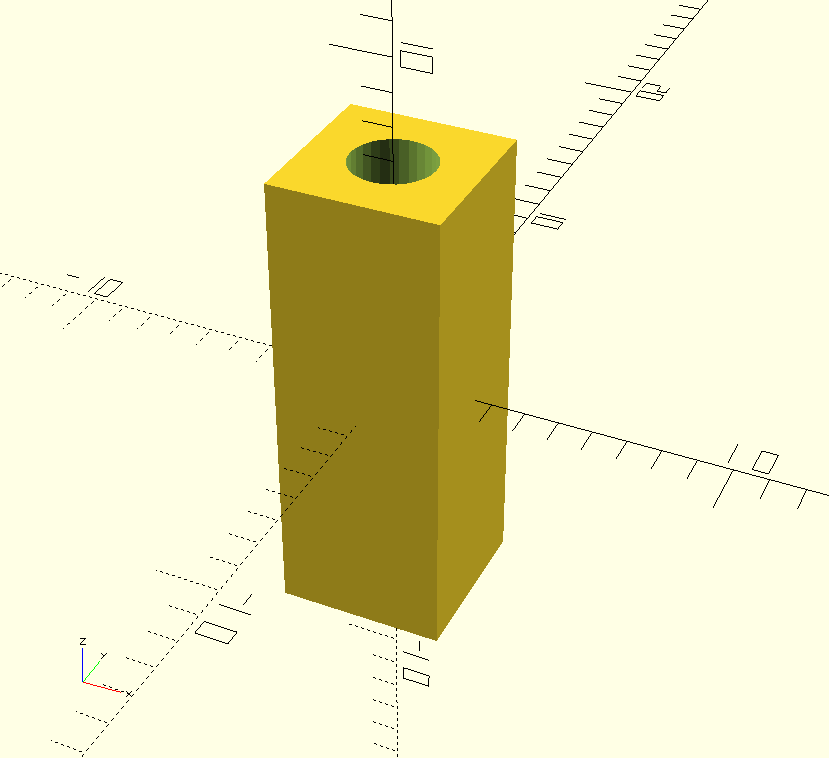

# pcb-standoffs

3D printable standoffs for tacking boards on the 2063-Z80 Retro! board.

These are designed to be printed with PLA or PETG.

An M2.5 bolt should self-tap into the standoff.

See the latest release for pre-rendered STL files.

